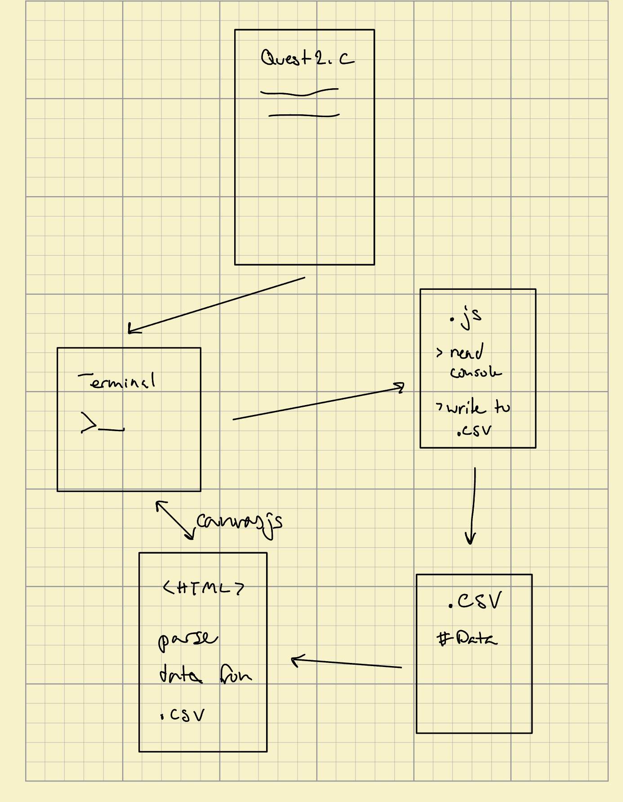
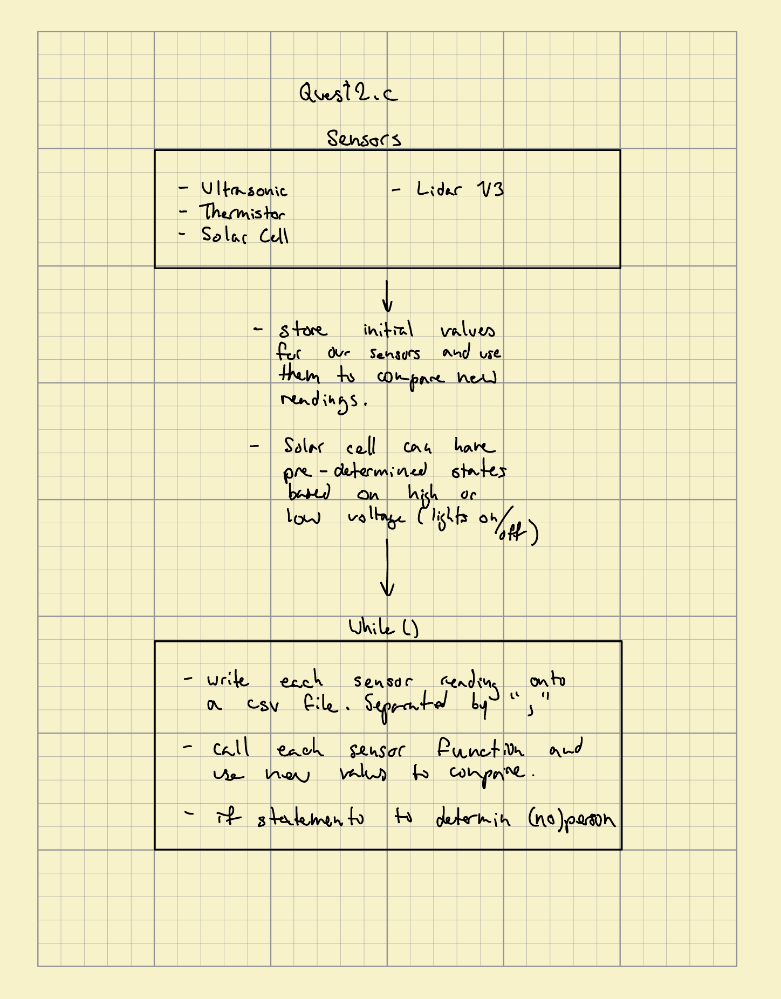

# Occupancy Counting

Authors: Marybel Boujaoude, Hassan Hijazi, Nicholas Hardy, Riya Deokar

Date: 2023-02-24

### Summary

The Occupancy Counting project is focused on developing a solution to sense the number of people present in a space using various sensors such as thermistors, solar cells, ultrasonic sensors, and IR rangefinders.

This code includes several libraries that we had worked with before such as: the Real-time operating system (RTOS), GPIO task, macros and constants related to I2C communication, and GPIO and LED pins. 

Our file initializes and configures the ADC channels for measuring voltage, ultrasonic, and photocell sensors. The get_voltage() function reads the ADC values and converts them to voltage in mV. The code also includes functions to test and scan I2C devices connected to the ESP32 board, as well as an initialization function for the I2C master port.

The file also contains several register definitions and functions to read data from the LIDAR-Lite distance sensor using I2C communication. It sets the measurement register, initiates a ranging measurement, and retrieves the high and low bytes of the measurement.We are also constantly reading the eFuse memory to determine if Two Point or Vref values have been burned. We split up the different sensors by putting respective functions and respective main commands into our Quest2.c.  

Quest2.c reads data from an ultrasonic distance sensor, a lidar distance sensor, a solar panel voltage sensor, and a temperature sensor. We Process the data to detect changes in temperature, solar panel voltage, and distance measurements in order to account for occupance. In our main, we configure a GPIO pin (connected to an LED) as an output. If any changes are detected, the LED is turned off; otherwise, the LED is turned on.The loop repeats indefinitely, with a delay of one second between iterations.

The goal of the project is to calibrate the sensors: by establishing their ranges, offsets, and limitations, specifying the pin assignments, and developing formulas to convert measured units into common engineering units among the sensors. We validated and tested all the sensors before we integrated them together and then displayed the measured values on the console. Using a node.js file, we wrote the console data to a .csv file and created an HTML file that outputted a real-time strip-chart display. Additionally, our solution had an LED that indicated the presence of a detection of occupancy for the duration of the detection, by switching the LED off.

### Supporting Artifacts
Link to video technical presentation: https://drive.google.com/file/d/1oDJhao9CzNB7l-SGE3h6BtSakAOTVBQH/view?usp=sharing
Link to video demo: https://drive.google.com/file/d/1EmnqX_IH03yqe1wHtGpJlllRLeuJhjsn/view?usp=sharing

### Self-Assessment 

| Objective Criterion | Rating | Max Value  | 
|---------------------------------------------|:-----------:|:---------:|
| Objective One | 1 |  1     | 
| Objective Two | 1 |  1     | 
| Objective Three | 1 |  1     | 
| Objective Four | 1 |  1     | 
| Objective Five | 1 |  1     | 
| Objective Six | 1 |  1     | 
| Objective Seven | 1 |  1     | 

### Solution Design

Quest Solution Design

Quest2.c Design

### Modules, Tools, Source Used Including Attribution

### References

Ultrasonic Pinout: https://drive.google.com/file/d/1Pil7c1lvuV19dqcNPBwHnfKMrV3vzoHM/view?usp=share_link

Range Finder: https://www.sparkfun.com/datasheets/Sensors/Infrared/gp2y0a02yk_e.pdf

Node.js Tutorial: https://www.w3schools.com/nodejs/default.asp

https://github.com/espressif/esp-idf/tree/39f090a4f1dee4e325f8109d880bf3627034d839/examples/peripherals/adc

https://github.com/espressif/esp-idf/tree/39f090a4f1dee4e325f8109d880bf3627034d839/examples/peripherals/adc

https://learn.adafruit.com/thermistor/using-a-thermistor

https://static.garmin.com/pumac/LIDAR_Lite_v3_Operation_Manual_and_Technical_Specifications.pdf

